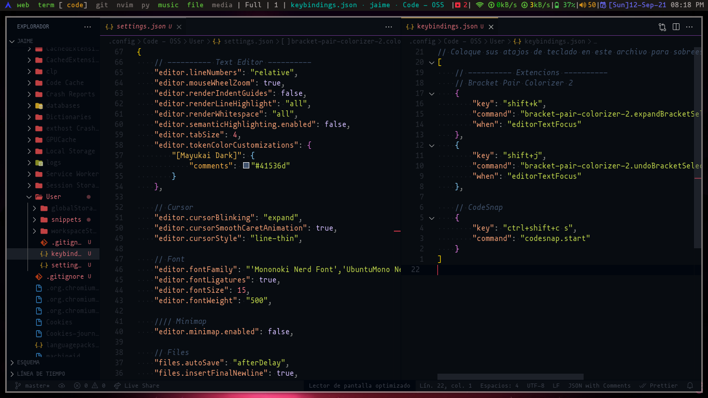

# Code-OSS



Copiar mis configuraciones.

```bash
git clone https://github.com/jaimeb-s/Dotfiles.git
cp Dotfiles/.config/Code\ -\ OSS/User/*.json ~/.config/Code\ -\ OSS/User
cp -r Dotfiles/.config/Code\ -\ OSS/User/snippets ~/.config/Code\ -\ OSS/User
```

# Extenciones

A continuacion se muestran las extenciones que utilizo.

|   Extencion   |
| ------------- |
| [Bracket Pair Colorizer 2](https://marketplace.visualstudio.com/items?itemName=CoenraadS.bracket-pair-colorizer-2)                    |
| [CodeSnap](https://marketplace.visualstudio.com/items?itemName=adpyke.codesnap)                                                       |
| [GitLens](https://marketplace.visualstudio.com/items?itemName=eamodio.gitlens)                                                        |
| [Live Share](https://marketplace.visualstudio.com/items?itemName=MS-vsliveshare.vsliveshare)                                          |
| [Material Icon Theme](https://marketplace.visualstudio.com/items?itemName=PKief.material-icon-theme)                                  |
| [Mayukai Theme](https://marketplace.visualstudio.com/items?itemName=GulajavaMinistudio.mayukaithemevsc)                               |
| [Spanish Language Pack for Visual Studio Code](https://marketplace.visualstudio.com/items?itemName=MS-CEINTL.vscode-language-pack-es) |
