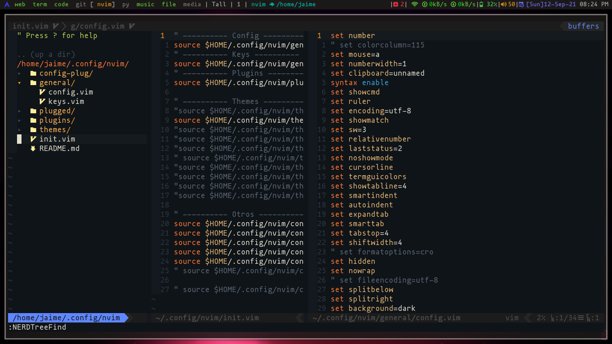

# Neovim



Instalar unas dependencias.

```bash
sudo pacman -S nodejs
```

Para utilzar mi configuracion hacer lo siguiente.

```bash
git clone https://github.com/jaimeb-s/Dotfiles.git
cp -r Dotfiles/.config/nvim ~/.config/
mkdir ~/.config/nvim/plugged
```

Descargar [vim-plug](https://github.com/junegunn/vim-plug) e instalar los pluggins

```bash
sh -c 'curl -fLo "${XDG_DATA_HOME:-$HOME/.local/share}"/nvim/site/autoload/plug.vim --create-dirs \
       https://raw.githubusercontent.com/junegunn/vim-plug/master/plug.vim'
# Abrir nvim y poner lo siguiente
:PlugInstall
```
