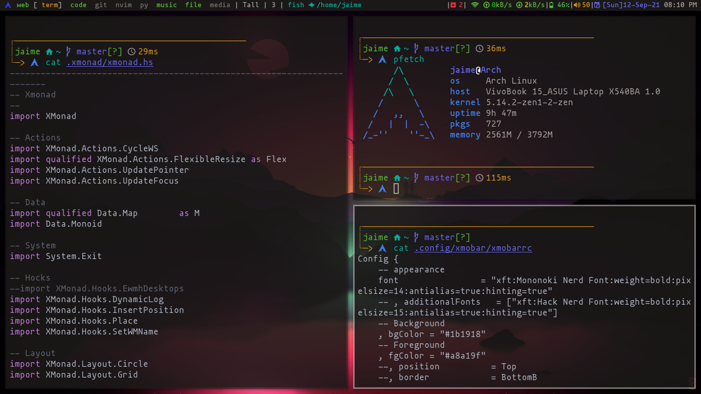

# Xmonad



Instalar los siguientes paquetes.

```bash
sudo pacman -S xmonad xmonad-contrib alacritty rofi code scrot brightnessctl xmobar feh xdotool pamixer pacman-contrib

paru -S google-chrome nerd-fonts-mononoki spotify
```

Y despues copiar los archivos.

```bash
git clone https://github.com/jaimeb-s/Dotfiles.git
cp -r Dotfiles/.config/xmobar ~/.config
cp -r Dotfiles/.xmonad ~/
cp -r Dotfiles/.wallpapers ~/
```

Finalmente recompile xmonad.

```bash
xmonad --recompile
```
